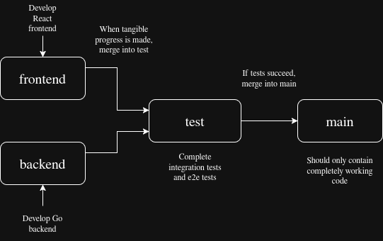

# Project smaash-web


This here repository contains the web app that goes along with the Unity game for our professional exam, written in Go with a TypeScript React frontend.

## Getting Started

This section details how to get the source of project on your local machine to develop or test. For notes on how to deploy, see the [deployment](#deployment) section of this document.

***
### Prerequisites
> You'll need the following tooling to be able to contribute:
  - Go tooling: Needed to run and compile the backend server. Find installation instructions for your OS [here](https://go.dev/doc/install).
  - A C compiler: Needed for compiling SQLite, our database of choice. On MacOS clang, and on any Linux distribution, gcc (both C compilers) is installed by default, no need to download it separately. On Windows, if you have Visual Studio installed, you have the MSVC compiler on your system, no further configuration needed. If you're not using VS, we recommend downloading MinGW (a runtime for gcc and LLVM) by runnung `choco install mingw`. If you don't have the chocolatey package manager for Windows (Which we recommend) you can install MinGW by following [their instructions](https://www.mingw-w64.org/getting-started/msys2/).
  - npm (Node Package Manager): Needed for running and building the website, which serves as the frontend of the application.
  
  ### Optional tools
  > These tools aren't necessary, but very helpful if you want to contribute:
  - Just: a script runner (to replace Make), which we use to make running certain commands, like running, building, testing and seeding much more convinient. Installation instructions [here](https://github.com/casey/just).
  
  >[!NOTE]
  > This documentation assumes that you have Just installed. If you choose not to use Just, you can run the commands defined in the [justfile](/jusfile) manually.
  
  - Go Air: a daemon that watches for changes and dynamically recompiles your Go projects while they're running, so for example, you don't have to restart the backend server when you make a change. Air is started by running `just watch`, which, if you don't have air installed, will ask you if you want to install it on your system, making installation a breeze.
***

1 - Clone the repo:
```bash
git clone https://github.com/SMAASH-project/Web.git
```

2 - Build project and seed database:
```bash
just all
```
This command will build the both the backend and the frontend, run all unit tests and seed the database with predefined data. For more on the project's seeder implementation, see the [seeder](#database-seeding) section of this document.

3 - Run:
Run the generated binary executable inside the build folder. Open your browser of choice, and navigate to [http://localhost/8080/app](http://localhost/8080/app) and admire the beauty of our creation (xd).

> [!IMPORTANT]
> So far the output of the main executable file is without extension, meaning the built binary most likely won't run on Windows. Fixing this is on our todo list.
***

## Development
This section details how to contribute to the project.

- *Dev servers*:  
For development, make use of the dev servers that come with the toolchain we're using. From the root of the project, execute the following command to run the backend server:
```bash
just run
```
Then to start the Vite frontend server:
```bash
cd client && npm run dev
```

- *Project structure*:  
The project contains the following folders:
+ **build**: contains the compiled binary of the app and the compiled assets it serves
+ **client**: contains the source code of the React TypeScript frontend project
+ **cmd**: contains the entry point(s) of programs included in the project (api and seeder in our case)
+ **docs**: contains documentation
+ **internal** contains the source code of the Go backend server

The documentation of the endpoints can be found in [/docs/endpoins.md](/docs/endpoints.md). For the schema of the DTOs, see inside the [/internal/DTOs](/internal/DTOs/) folder.

For wrintig code, refer to the style guides and idioms of the languages we're using:
 - [Go standard](https://go.dev/doc/effective_go)
 - [React standard](https://react.dev/reference/rules)

## Database seeding

The project defines a database seeder, which can be used in the following way:
1. Define some data you want to inject into the database in `internal/seeder/source` in a json format, e.g:  
  ```json
  // internal/seeder/source/users.json
[
  {
    "Email": "example@example.com",
    "Password": "pass12345",
    "RoleID": 2
  },
  {
    "Email": "example@admin.com",
    "Password": "admin1234",
    "RoleID": 1
  },
  {
    "Email": "example@support.com",
    "Password": "support1234",
    "RoleID": 3
  }
]
```

2. Run `just seed` and watch the result in your terminal.

## Version control and CI/CD
Here are the branches defined in this repository (and how to use them):
- **main**: The main branch, you cannot push here. Main can only be populated via pull request from the **test** branch.
- **test**: This branch is for testing the application before merging into main. You cannot push here, test can only be populated via pull requests from the **backend** and **frontend** branches.
- **backend**: For developing the Go backend server. If you've worked on the server, push your commits here.
- **fontend**: For developing the React SPA frontend. If you've worked on the website, push your commits here.

Flow of version control:


The repo utilizes a GitHub action for a CI pipeline. On every push or pull request, the project is built, the seeder is ran (on an in memory DB for testing purposes) and unit tests are executed. If any of these operations fail, a merge into main should'nt be made.

## Deployment
To build the project, run `just build-fullstack` to build both the frontend and the backend. The result is the contents of the build folder, which contains the binary executalbe of the app, and in the client folder, the static assets it serves.

> [!NOTE]
> Explicit cross compilation is not yet supported, it is on our agenda.

Deploy the contents of the build folder by any means you like
