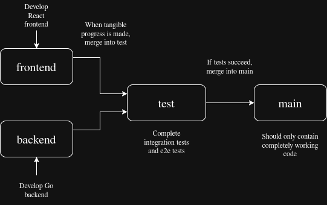

# Project smaash-web


This here repository contains the web app that goes along with the Unity game for our professional exam, written in Go with a TypeScript React frontend.


## Getting Started

This section details how to get the source of project on your local machine to develop or test. For notes on how to deploy, see the [deployment](#deployment) section of this document.


### Prerequisites

> You'll need the following tooling to be able to contribute:

- Go tooling: Needed to run and compile the backend server. Find installation instructions for your OS [here](https://go.dev/doc/install).
- gcc: a C compiler needed to compile the CGO utility, which is used as a pseudo FFI between Go and C. Only needed if you decide to use a CGO based SQLite driver, which we no longer do, so this dependency is obsolete in the later releases. It stays in this document though so that testers choosing to switch database drivers don't accidentally miss this (like we did)
- npm (Node Package Manager): Needed for running and building the website, which serves as the frontend of the application.

### Optional tools

> These tools aren't necessary, but very helpful if you want to contribute:

- Just: a script runner (to replace Make), which we use to make running certain commands, like running, building, testing and seeding much more convinient. Installation instructions [here](https://github.com/casey/just).

> [!NOTE]
> This documentation assumes that you have Just installed. If you choose not to use Just, you can run the commands defined in the [justfile](/jusfile) manually.

- Go Air: a daemon that watches for changes and dynamically recompiles your Go projects while they're running, so for example, you don't have to restart the backend server when you make a change. Air is started by running `just watch`, which, if you don't have air installed, will ask you if you want to install it on your system, making installation a breeze.

---

### Environment variables

The app depends on the following environment variables:

- PORT (default: 8080)
- DB_URL (default: test.db)
- SEED_DATA_URI (default: ./internal/seeder/test_source)
- SECRET_KEY (default: super_secret_key)
- ALLOWED_ORIGINS (default: http://localhost:5173)
- UPLOAD_DIR (default: ./uploads)

### Setting up the project

1 - Clone the repo:

```bash
git clone https://github.com/SMAASH-project/Web.git
```

2 - Build project and seed database:

```bash
just all
```

This command will build the both the backend and the frontend, run all unit tests and seed the database with predefined data. For more on the project's seeder implementation, see the [seeder](#database-seeding) section of this document.

3 - Run:
Run the generated binary executable inside the build folder. Open your browser of choice, and navigate to [http://localhost:8080/app](http://localhost:8080/app) and admire the beauty of our creation (xd).

> [!IMPORTANT]
> So far the output of the main executable file is without extension, meaning the built binary most likely won't run on Windows. Fixing this is on our todo list.

---

## Development

This section details how to contribute to the project.

- _Dev servers_:  
  For development, make use of the dev servers that come with the toolchain we're using. From the root of the project, execute the following command to run the backend server:

```bash
just run
```

Then to start the Vite frontend server:

```bash
cd client && npm run dev
```

- _Project structure_:  
  The project contains the following folders:

* **build**: contains the compiled binary of the app and the compiled assets it serves
* **client**: contains the source code of the React TypeScript frontend project
* **cmd**: contains the entry point(s) of programs included in the project (api and seeder in our case)
* **docs**: contains documentation
* **internal** contains the source code of the Go backend server

The documentation of the endpoints can be found in [/docs/endpoins.md](/docs/endpoints.md). For the schema of the DTOs, see inside the [/internal/DTOs](/internal/DTOs/) folder.

- _Dependency injection, layers_:  
  The project adheres to the following layering:  
  **database** -> **repository** -> **service** (optional) -> **controller** -> **server**  
  The workflow of creating endpoints should be as follows:
  1. Create a custom repository for your modes, or use the generic one
  2. If you need to handle buisness login, put it in a service which depends on your repo
  3. Define a controller that depends on your service, or if you didn't need one, your repo directly
  4. In the initialize function, found in /internal/initializer/initailzer.go, register your controller

> [!WARNING]
> NEVER put database queries or buisness logic in a controller. That's what repositories and services are for. Instead, make your controller depend on your services/repos by utilizing [dependency injection](https://www.freecodecamp.org/news/how-to-use-dependency-injection-in-go/)

- _Defining repositories_:
  The project is making use of the [repository design pattern](https://dev.to/team3/repository-pattern-in-golang-a-practical-guide-1kla). A generic **BaseRepository** can be used in case you only need basic CRUD actions for a type in it's corresponging controller or service. E.g:

```Go
type RolesController struct {
	rolesBaseRepo repository.BaseRepository[models.Role]
}
```

In case you need custom or extended functionality, you can define a custom repo for a model in /internal/repository, by embedding the BaseRepository interface in your custom repo's interface, like so:

```Go
type UserRepository interface {
	BaseRepository[models.User]
	ReadByEmail(context.Context, string) (models.User, error)
}

type UserRepositoryActions struct {
	conn *gorm.DB
	BaseRepository[models.User]
}
```

For wrintig code, refer to the style guides and idioms of the languages we're using:

- [Go standard](https://go.dev/doc/effective_go)
- [React standard](https://react.dev/reference/rules)

## Debug & Admin panel

The app ships with a built-in debug/admin panel at `/app/debug`. Access is restricted to users with the **admin** role.

### Tabs

| Tab | Description |
|-----|-------------|
| System | Browser info, display metrics, session, environment flags |
| Endpoints | Interactive REST API explorer with quick-route presets and response inspector |
| Cache | React Query cache browser — view, filter, invalidate, and remove cached queries |
| Game Data | CRUD for characters, levels, and store items; user management (ban, promote, demote) |
| Database | Generic data browser for all 11 API-exposed resources with row-level CRUD, schema view, session history, and a clearly marked danger zone |
| Visual | Animation speed, layout borders, element inspector, FPS counter, scroll position overlay, CSS variable inspector |
| Emulation | Viewport emulation presets, forced reduced motion, compact density, network delay/jitter simulation |
| Diagnostics | A11y contrast ratios, render counters, React Query status, click-target and z-index inspectors |

The debug settings (animation speed, viewport overrides, network simulation, etc.) are persisted to `localStorage` under the key `debug-settings`.

---

## Database seeding

The project defines a database seeder, which can be used in the following way:

1. Define some data you want to inject into the database in `internal/seeder/source` in a json format, e.g:

```json
// internal/seeder/source/users.json
[
  {
    "Email": "example@example.com",
    "Password": "pass12345",
    "RoleID": 2
  },
  {
    "Email": "example@admin.com",
    "Password": "admin1234",
    "RoleID": 1
  },
  {
    "Email": "example@support.com",
    "Password": "support1234",
    "RoleID": 3
  }
]
```

2. Run `just seed` and watch the result in your terminal.

> [!NOTE]
> The json source data has to follow the Go casing rules for public struct fields (Pascal case)

## Swagger documentation

This project makes use of the [swaggo/gin-swagger](https://github.com/swaggo/gin-swagger) library, allowing declarative documentation comments to be used as OpenAPI definitions when automatically generating swagger docs. An example documentation for a controller:

```Go
// @description Creates a new role
// @tags roles
// @accept json
// @produce json
// @param role_create_dto body dtos.RoleCreateDTO true "dto for creating a new role"
// @success 201 {object} dtos.RoleReadDTO "returns newly created role"
// @failure 400 {object} dtos.ErrResp "request body in wrong format"
// @failure 401 {object} dtos.ErrResp "unauthorized"
// @failure 409 {object} dtos.ErrResp "unique key violation"
// @failure 500 {object} dtos.ErrResp "internal server error"
// @router /roles [post]
func (rc RolesController) Create(c *gin.Context) {...}
```

A detailed listing of available doc comments can be found [here](https://github.com/swaggo/swag/blob/master/README.md#declarative-comments-format)

When you're done doc-commenting your code run `just swagger` to generate the swagger.json and swagger.yml files. To view the generated web UI of the docs, navigate to `/swagger/index.html`

## Version control and CI/CD

Here are the branches defined in this repository (and how to use them):

- **main**: The main branch, you cannot push here. Main can only be populated via pull request from the **test** branch.
- **test**: This branch is for testing the application before merging into main. You cannot push here, test can only be populated via pull requests from the **backend** and **frontend** branches.
- **backend**: For developing the Go backend server. If you've worked on the server, push your commits here.
- **frontend**: For developing the React SPA frontend. If you've worked on the website, push your commits here.

Flow of version control:


The repo utilizes a GitHub action for a CI pipeline. On every push or pull request, the project is built, the seeder is ran (on an in memory DB for testing purposes) and unit tests are executed. If any of these operations fail, a merge into main should'nt be made.

## Deployment

To build the project, run `just build-fullstack` to build both the frontend and the backend. The result is the contents of the build folder, which contains the binary executalbe of the app, and in the client folder, the static assets it serves.

> [!NOTE]
> Explicit cross compilation is not yet supported, it is on our agenda.

Deploy the contents of the build folder by any means you like
