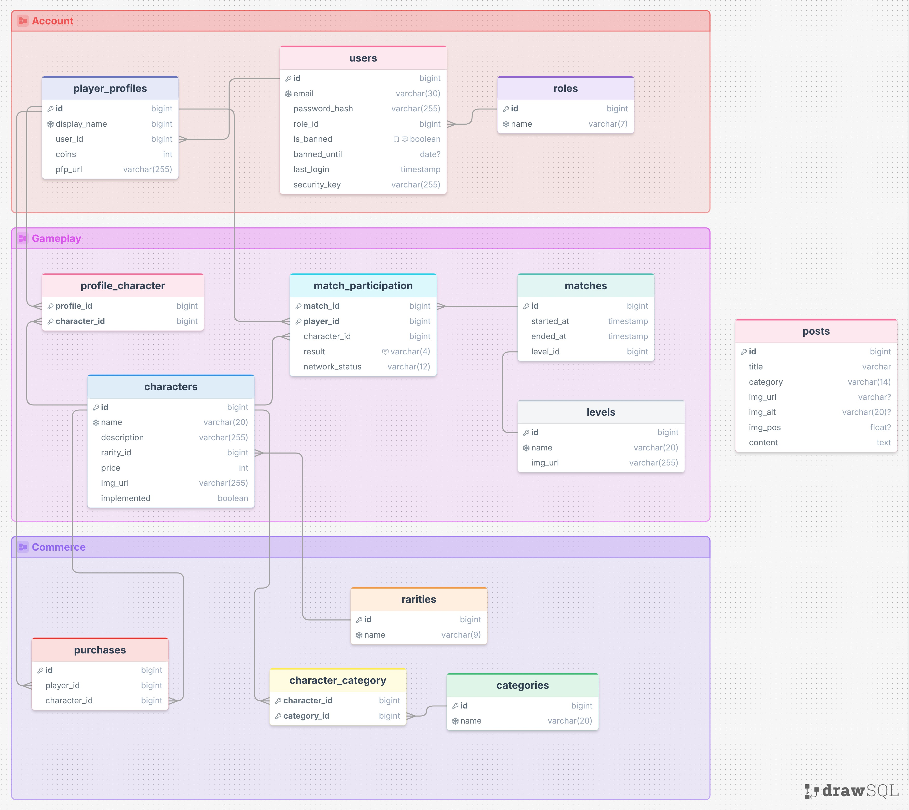

# Az adatmodell leírása 
Projektünk atadmodellje 3 fő területre osztható: 
  - **Felhasználók:** A szolgáltatásunkba regisztrált felhasználók, az ő szerepköreik és profiljaik.
  - **Webshop:** A weboldalon szereplő boltban megvásárolható karakterek, kategóriák és a vásárlások rekordjai
  - **Játék:** A SMAASH mobiljátékban lebonyolított meccsek, karakterek és pályák

Az adatbázis modelljét az alábbi diagram összegzi:


> Fontos megjegyzés: A diagramm átláthatósága érdekében nem lettek feltüntetve a minden nem N:M kötőtáblán szereplő `created_at`, `updated_at` és `deleted_at` mezők. Ezen mezők tartalma minden insert, update és delete művelet során automatikusan beállításra kerül. A `deleted_at` mező értékének beállítása helyettesíti a törlés funkcióját. (Soft deletion)

## Táblák jellemzése

 - **users tábla:** tárolja a regisztrált felhasználók adatait

| **Mező neve** | **Leírás**                                    | **Típus**    | **Megszorítás**                            |
|---------------|-----------------------------------------------|--------------|--------------------------------------------|
| id            | a felhasználó egyedi azonosítója              | integer      | elsődleges kulcs, not null, auto increment |
| email         | a felhasználó email címe                      | varchar(30)  | unique, not null                           |
| password_hash | a felhasználó titkosított jelszava            | varchar(255) | not null                                   |
| role_id       | a felhasználó szerepére hivatkozó idegen kulcs| integer      | idegen kulcs, not null                     |
| is_banned     | a felhasználó el van-e tiltva                 | boolean      | not null                                   |
| banned_until  | a felhasználó eltiltásának határideje         | datetime     | -                                          |
| last_login    | a felhasználó utolsó bejelentkezésének dátuma | datetime     | not null                                   |
| security_key  | jelszóváltoztatáshoz szükséges egyedi kulcs   | varchar(255) | not null                                   |

 - **player_profiles tábla:** tárolja a felhasználók egy-egy profiljának adatait

| **Mező neve** | **Leírás**                                    | **Típus**    | **Megszorítás**                            |
|---------------|-----------------------------------------------|--------------|--------------------------------------------|
| id            | a profil egyedi azonosítója                   | integer      | elsődleges kulcs, not null, auto increment |
| diplay_name   | a profil neve                                 | varchar(20)  | unique, not null                           |
| user_id       | idegen kulcs a profilt birtokló user-re       | integer      | idegen kulcs, not null                     |
| coins         | a profil érméinek száma                       | integer      | not null                                   |
| pfp_uri       | a profil képének elérési útvonala             | varchar(255) | -                                          |
|cropped_pfp_uri| a profil kisméretű képének elérési útvonala   | varchar(255) | -                                          |

 - **roles tábla:** tárolja a felhasználókhoz hozzárendelhető szerepköröket

| **Mező neve** | **Leírás**                                    | **Típus**    | **Megszorítás**                            |
|---------------|-----------------------------------------------|--------------|--------------------------------------------|
| id            | a szerepkör egyedi azonosítója                | integer      | elsődleges kulcs, not null, auto increment |
| name          | a szerepkör neve                              | varchar(7)   | unique, not null                           |

 - **purchases tábla:** tárolja a vásárlások adatait

| **Mező neve**     | **Leírás**                                    | **Típus**    | **Megszorítás**                            |
|-------------------|-----------------------------------------------|--------------|--------------------------------------------|
| id                | a vásárlás egyedi azonosítója                 | integer      | elsődleges kulcs, not null, auto increment |
| player_profile_id | idegen kulcs a vásárló profilra               | integer      | idegen kulcs, not null                     |
| character_id      | idegen kulcs a vásárolt karakterre            | integer      | idegen kulcs, not null                     |

 - **categories tábla:** tárolja a karakterekhez tartozó kategóriák adatait

| **Mező neve** | **Leírás**                                    | **Típus**    | **Megszorítás**                            |
|---------------|-----------------------------------------------|--------------|--------------------------------------------|
| id            | a kategória egyedi azonosítója                | integer      | elsődleges kulcs, not null, auto increment |
| name          | a kategória neve                              | varchar(20)  | unique, not null                           |

 - **character_category tábla:** kapcsolattábla a karakterek és kategóriáik között

| **Mező neve** | **Leírás**                                    | **Típus**    | **Megszorítás**                            |
|---------------|-----------------------------------------------|--------------|--------------------------------------------|
| character_id  | a kapcsolatban szereplő karakter azonosítója  | integer      | elsődleges kulcs, not null                 |
| category_id   | a kapcsolatban szereplő kategória azonosítója | integer      | elsődleges kulcs, not null                 |

 - **rarities tábla:** tárolja a webshop karaktereihez tartozó ritkaságok adatait

| **Mező neve** | **Leírás**                                    | **Típus**    | **Megszorítás**                            |
|---------------|-----------------------------------------------|--------------|--------------------------------------------|
| id            | a ritkaság egyedi azonosítója                 | integer      | elsődleges kulcs, not null, auto increment |
| name          | a ritkaság neve                               | varchar(9)   | unique, not null                           |

 - **matches tábla:** tárolja a lejátszott meccsek adatait

| **Mező neve**     | **Leírás**                                    | **Típus**    | **Megszorítás**                            |
|-------------------|-----------------------------------------------|--------------|--------------------------------------------|
| id                | a meccs egyedi azonosítója                    | integer      | elsődleges kulcs, not null, auto increment |
| started_at        | a meccs kezdetének idópontja                  | datetime     | not null                                   |
| ended_at          | a meccs végének időpontja                     | datetime     | not null                                   |
| level_id          | idegen kulcs a meccs pályájára                | integer      | idegen kulcs, not null                     |

 - **levels tábla:** tárolja a meccsek helyszínéül szolgáló pályák adatait

| **Mező neve** | **Leírás**                                    | **Típus**    | **Megszorítás**                            |
|---------------|-----------------------------------------------|--------------|--------------------------------------------|
| id            | a pálya egyedi azonosítója                    | integer      | elsődleges kulcs, not null, auto increment |
| name          | a pálya neve                                  | varchar(20)  | unique, not null                           |
| img_uri       | a pályához tartozó kép helye a szerveren      | varchar(255) | not null                                   |
|cropped_img_uri| a pálya kisebb képének helye a szerveren      | varchar(255) | not null                                   |

 - **match_participation tábla:** kapcsolattábla a meccsek, profilok és karakterek között

| **Mező neve**     | **Leírás**                                    | **Típus**    | **Megszorítás**                            |
|-------------------|-----------------------------------------------|--------------|--------------------------------------------|
| match_id          | a kapcsolatban szereplő meccs azonosítója     | integer      | elsődleges kulcs, not null                 |
| player_id         | a lapcsolatban szereplő profil azonosítója    | integer      | elsődleges kulcs, not null                 |
| character_id      | idegen kulcs a meccsben a játékos karakterére | integer      | idegen kulcs, not null                     |
| result            | a játékos elért eredménye                     | varchar(4)   | not null                                   |
| network_status    | a hálózat állapota a meccs során              | varchar(12)  | not null                                   |

 - **characters tábla:** tárolja a játszható karakterek adatait

| **Mező neve** | **Leírás**                                    | **Típus**    | **Megszorítás**                            |
|---------------|-----------------------------------------------|--------------|--------------------------------------------|
| id            | a karakter egyedi azonosítója                 | integer      | elsődleges kulcs, not null, auto increment |
| name          | a karakter neve                               | varchar(20)  | unique, not null                           |
| description   | a karakter leírása                            | varchar(255) | not null                                   |
| rarity_id     | a karakterhez tartozó ritkaság azonosítója    | integer      | not null                                   |
| price         | a karakter ára                                | integer      | not null                                   |
| img_uri       | a karakterhez tartozó kép helye a szerveren   | varchar(255) | not null                                   |
|cropped_img_uri| a karakter kisebb képének helye a szerveren   | varchar(255) | not null                                   |
| implemented   | tartozik-e a rekordhoz játékbeli implementáció| boolean      | not null                                   |

 - **profile_character tábla:** N:M kapcsolattábla a profilok és karakterek között

| **Mező neve** | **Leírás**                                    | **Típus**    | **Megszorítás**                            |
|---------------|-----------------------------------------------|--------------|--------------------------------------------|
| profile_id    | a kapcsolatban szereplő profil azonosítója    | integer      | elsődleges kulcs, not null                 |
| character_id  | a kapcsolatban szereplő karakter azonosítója  | integer      | elsődleges kulcs, not null                 |


 - **posts tábla:** tárolja a weboldalon megjelenített bejegyzéseket

| **Mező neve** | **Leírás**                                    | **Típus**    | **Megszorítás**                            |
|---------------|-----------------------------------------------|--------------|--------------------------------------------|
| id            | a bejegyzés egyedi azonosítója                | integer      | elsődleges kulcs, not null, auto increment |
| title         | a bejegyzés címe                              | varchar(30)  | not null                                   |
| category      | a bejegyzés kategóriája                       | varchar(14)  | not null                                   |
| img_url       | a bejegyzéshez tartozó kép helye a szerveren  | varchar(255) | _                                          |
| img_alt       | a bejegyzéshez tartozó kép címe               | varchar(255) | _                                          |
| img_pos       | a bejegyzéshez tartozó kép arányos elhelyezése| float        | -                                          |
| content       | a bejegyzés szöveges tartalma                 | text         | not null                                   |

## Táblák kapcsolatai:

- users - player_profiles: *1:N*
- users - roles: *N:1*
- player_profiles - purchases: *1:N*
- player_profiles - characters: *N:M*
- purchases - characters: *N:1*
- characters - categories: *N:M*
- characters - rarities: *N:1*
- player_profiles - match_participation: *1:N*
- match_participation - matches: *N:1*
- match_participation - characters: *N:1*
- matches - levels: *N:1*

> Megjegyzés: A match_participation tábla lényegében tekinthető a player_profiles és a matches közötti *N:M* kapcsolattáblának, illetve a matches és a characters közötti *N:M* kapcsolattáblának is.

# Végpont Dokumentáció

> **Alap URL:** `/api`
> **Formátum:** JSON (kivéve fájlfeltöltések: `multipart/form-data`)
> **Hitelesítés:** JWT token – HTTP-only sütiben (`Authorization`) **vagy** `Authorization: Bearer <token>` fejlécben

---

## Tartalomjegyzék

- [Hitelesítés](#-hitelesítés)
- [Felhasználók](#-felhasználók)
- [Profilok](#-profilok)
- [Karakterek](#-karakterek)
- [Pályák](#-pályák)
- [Kategóriák](#-kategóriák)
- [Ritkaságok](#-ritkaságok)
- [Szerepkörök](#-szerepkörök)
- [Meccsek](#-meccsek)
- [Vásárlások](#-vásárlások)
- [Bejegyzések](#-bejegyzések)
- [Statisztikák](#-statisztikák)
- [Játék Hitelesítés](#-játék-hitelesítés)
- [Adatmodellek](#-adatmodellek)

---

## Hitelesítés

### `POST /api/auth/signup`

Új felhasználó regisztrációja.

**Jogosultság:** Nyilvános

**Kérés törzse:**

| Mező | Típus | Kötelező | Leírás |
|------|-------|----------|--------|
| `email` | string | igen | Érvényes e-mail cím (max. 30 karakter) |
| `password` | string | igen | Jelszó (min. 8, max. 50 karakter) |

```json
{
  "email": "janos@example.com",
  "password": "biztonságos123"
}
```

**Válaszok:**

| Kód | Leírás |
|-----|--------|
| `201 Created` | Sikeres regisztráció, visszaadja az új felhasználót és a biztonsági kulcsot |
| `409 Conflict` | Ez az e-mail cím már regisztrált |
| `422 Unprocessable Entity` | Hibás kérés formátum |
| `500 Internal Server Error` | Szerverhiba |

**Sikeres válasz (`201`):**
```json
{
  "id": 1,
  "email": "janos@example.com",
  "security_key": "base64-kódolt-kulcs"
}
```

---

### `POST /api/auth/login`

Felhasználó bejelentkeztetése. Sikeres bejelentkezés esetén a JWT tokent HTTP-only sütibe helyezi.

**Jogosultság:** Nyilvános

**Kérés törzse:**

| Mező | Típus | Kötelező | Leírás |
|------|-------|----------|--------|
| `email` | string | igen | A regisztrált e-mail cím |
| `password` | string | igen | A jelszó |

```json
{
  "email": "janos@example.com",
  "password": "biztonságos123"
}
```

**Válaszok:**

| Kód | Leírás |
|-----|--------|
| `200 OK` | Sikeres bejelentkezés |
| `401 Unauthorized` | Hibás jelszó, nem létező felhasználó vagy tiltott fiók |
| `422 Unprocessable Entity` | Hibás kérés formátum |
| `500 Internal Server Error` | Szerverhiba |

**Sikeres válasz (`200`):**
```json
{
  "id": 1,
  "role": "user"
}
```

---

### `POST /api/auth/logout`

Felhasználó kijelentkeztetése (törli az `Authorization` sütit).

**Jogosultság:** Nyilvános

**Válaszok:**

| Kód | Leírás |
|-----|--------|
| `204 No Content` | Sikeres kijelentkezés |

---

### `PUT /api/auth/change-password`

Jelszó megváltoztatása a biztonsági kulcs segítségével.

**Jogosultság:** Bejelentkezett felhasználó (`ANY`)

**Kérés törzse:**

| Mező | Típus | Kötelező | Leírás |
|------|-------|----------|--------|
| `id` | integer | igen | A felhasználó azonosítója |
| `new_password` | string | igen | Az új jelszó |
| `security_key` | string | igen | A regisztrációkor kapott biztonsági kulcs |

```json
{
  "id": 1,
  "new_password": "újJelszó456",
  "security_key": "base64-kódolt-kulcs"
}
```

**Válaszok:**

| Kód | Leírás |
|-----|--------|
| `200 OK` | Jelszó sikeresen megváltoztatva, visszaad egy új biztonsági kulcsot |
| `401 Unauthorized` | Érvénytelen biztonsági kulcs |
| `404 Not Found` | Felhasználó nem található |
| `422 Unprocessable Entity` | Hibás kérés formátum |
| `500 Internal Server Error` | Szerverhiba |

**Sikeres válasz (`200`):**
```json
{
  "new_key": "új-base64-kódolt-kulcs"
}
```

---

## Felhasználók

### `GET /api/users`

Az összes felhasználó listázása (lapozással).

**Jogosultság:** Admin

**Lekérdezési paraméterek:**

| Paraméter | Típus | Leírás |
|-----------|-------|--------|
| `page` | integer | Oldalszám (alapértelmezett: 1) |
| `size` | integer | Oldalméret |
| `sortBy` | string | Rendezési mező (`id`, `last_login`) |
| `desc` | boolean | Csökkenő sorrend |

**Válaszok:**

| Kód | Leírás |
|-----|--------|
| `200 OK` | Felhasználók listája |
| `401 Unauthorized` | Nincs jogosultság |
| `500 Internal Server Error` | Szerverhiba |

---

### `GET /api/users/:id`

Egy adott felhasználó lekérdezése azonosító alapján.

**Jogosultság:** Bejelentkezett felhasználó (`ANY`)

**Útvonal paraméter:**

| Paraméter | Típus | Leírás |
|-----------|-------|--------|
| `id` | integer | A felhasználó azonosítója |

**Válaszok:**

| Kód | Leírás |
|-----|--------|
| `200 OK` | A felhasználó adatai |
| `401 Unauthorized` | Nincs jogosultság |
| `404 Not Found` | Felhasználó nem található |
| `500 Internal Server Error` | Szerverhiba |

**Sikeres válasz (`200`):**
```json
{
  "id": 1,
  "email": "janos@example.com",
  "role": "user",
  "is_banned": false,
  "banned_until": "",
  "last_login": "17 Apr 26 10:00 CEST"
}
```

---

### `PUT /api/users/:id`

Felhasználó adatainak frissítése. **Jelszó itt nem módosítható.**

**Jogosultság:** Bejelentkezett felhasználó (`ANY`)

**Útvonal paraméter:**

| Paraméter | Típus | Leírás |
|-----------|-------|--------|
| `id` | integer | A felhasználó azonosítója |

**Kérés törzse:**

| Mező | Típus | Kötelező | Leírás |
|------|-------|----------|--------|
| `id` | integer | igen | Egyeznie kell az URL-beli azonosítóval |
| `email` | string | igen | Új e-mail cím (max. 30 karakter) |
| `role_id` | integer | nem | Új szerepkör azonosítója |

**Válaszok:**

| Kód | Leírás |
|-----|--------|
| `204 No Content` | Sikeres frissítés |
| `400 Bad Request` | Az URL és a kérés törzsében lévő azonosítók nem egyeznek |
| `401 Unauthorized` | Nincs jogosultság |
| `404 Not Found` | Felhasználó nem található |
| `409 Conflict` | Az e-mail cím már foglalt |
| `422 Unprocessable Entity` | Hibás kérés formátum |
| `500 Internal Server Error` | Szerverhiba |

---

### `DELETE /api/users/:id`

Felhasználó törlése.

**Jogosultság:** Bejelentkezett felhasználó (`ANY`)

**Útvonal paraméter:**

| Paraméter | Típus | Leírás |
|-----------|-------|--------|
| `id` | integer | A felhasználó azonosítója |

**Válaszok:**

| Kód | Leírás |
|-----|--------|
| `204 No Content` | Sikeres törlés |
| `401 Unauthorized` | Nincs jogosultság |
| `404 Not Found` | Felhasználó nem található |
| `500 Internal Server Error` | Szerverhiba |

---

### `GET /api/users/whoami`

Visszaadja a jelenleg bejelentkezett felhasználó adatait a JWT token alapján.

**Jogosultság:** Bejelentkezett felhasználó (`ANY`)

**Válaszok:**

| Kód | Leírás |
|-----|--------|
| `200 OK` | A bejelentkezett felhasználó adatai |
| `404 Not Found` | Felhasználó nem található |
| `500 Internal Server Error` | Szerverhiba |

---

### `GET /api/users/:id/profiles`

Egy adott felhasználó összes profiljának listázása.

**Jogosultság:** Bejelentkezett felhasználó (`ANY`)

**Útvonal paraméter:**

| Paraméter | Típus | Leírás |
|-----------|-------|--------|
| `id` | integer | A felhasználó azonosítója |

**Válaszok:**

| Kód | Leírás |
|-----|--------|
| `200 OK` | A felhasználó profiljainak listája |
| `401 Unauthorized` | Nincs jogosultság |
| `404 Not Found` | Felhasználó nem található |
| `500 Internal Server Error` | Szerverhiba |

---

### `POST /api/users/:id/profiles`

Új profil hozzáadása egy meglévő felhasználóhoz. (Max. 5 profil/felhasználó)

**Jogosultság:** Bejelentkezett felhasználó (`ANY`)

**Útvonal paraméter:**

| Paraméter | Típus | Leírás |
|-----------|-------|--------|
| `id` | integer | A felhasználó azonosítója |

**Kérés törzse:**

| Mező | Típus | Kötelező | Leírás |
|------|-------|----------|--------|
| `display_name` | string | igen | A profil megjelenítési neve (max. 20 karakter) |

**Válaszok:**

| Kód | Leírás |
|-----|--------|
| `201 Created` | Sikeresen létrehozott profil |
| `401 Unauthorized` | Nincs jogosultság |
| `403 Forbidden` | Elérte a maximális profilszámot (5) |
| `404 Not Found` | Felhasználó nem található |
| `409 Conflict` | A megjelenítési név már foglalt |
| `422 Unprocessable Entity` | Hibás kérés formátum |
| `500 Internal Server Error` | Szerverhiba |

---

### `POST /api/users/:id/ban`

Felhasználó tiltása megadott ideig.

**Jogosultság:** Admin

**Útvonal paraméter:**

| Paraméter | Típus | Leírás |
|-----------|-------|--------|
| `id` | integer | A felhasználó azonosítója |

**Kérés törzse:**

| Mező | Típus | Kötelező | Leírás |
|------|-------|----------|--------|
| `id` | integer | igen | Egyeznie kell az URL-beli azonosítóval |
| `period` | integer | igen | A tiltás időtartama percekben |

**Válaszok:**

| Kód | Leírás |
|-----|--------|
| `200 OK` | Sikeres tiltás, visszaadja a tiltás időtartamát |
| `400 Bad Request` | Azonosítók nem egyeznek |
| `401 Unauthorized` | Nincs jogosultság |
| `404 Not Found` | Felhasználó nem található |
| `422 Unprocessable Entity` | Hibás kérés formátum |
| `500 Internal Server Error` | Szerverhiba |

---

### `POST /api/users/:id/unban`

Felhasználó tiltásának feloldása.

**Jogosultság:** Admin

**Útvonal paraméter:**

| Paraméter | Típus | Leírás |
|-----------|-------|--------|
| `id` | integer | A felhasználó azonosítója |

**Válaszok:**

| Kód | Leírás |
|-----|--------|
| `204 No Content` | Sikeres tiltásfeloldás |
| `401 Unauthorized` | Nincs jogosultság |
| `404 Not Found` | Felhasználó nem található |
| `500 Internal Server Error` | Szerverhiba |

---

### `POST /api/users/:id/promote`

Felhasználó jogosultsági szintjének emelése (`admin` vagy `support` szerepkörre).

**Jogosultság:** Admin

**Útvonal paraméter:**

| Paraméter | Típus | Leírás |
|-----------|-------|--------|
| `id` | integer | A felhasználó azonosítója |

**Kérés törzse:**

| Mező | Típus | Kötelező | Leírás |
|------|-------|----------|--------|
| `id` | integer | igen | Egyeznie kell az URL-beli azonosítóval |
| `target_role` | string | igen | `admin` vagy `support` |

**Válaszok:**

| Kód | Leírás |
|-----|--------|
| `204 No Content` | Sikeres rangemeléss |
| `400 Bad Request` | Azonosítók nem egyeznek |
| `401 Unauthorized` | Nincs jogosultság |
| `404 Not Found` | Felhasználó vagy szerepkör nem található |
| `422 Unprocessable Entity` | Hibás kérés formátum |
| `500 Internal Server Error` | Szerverhiba |

---

### `POST /api/users/:id/demote`

Felhasználó visszaminősítése alap (`user`) jogosultsági szintre.

**Jogosultság:** Admin

**Útvonal paraméter:**

| Paraméter | Típus | Leírás |
|-----------|-------|--------|
| `id` | integer | A felhasználó azonosítója |

**Válaszok:**

| Kód | Leírás |
|-----|--------|
| `204 No Content` | Sikeres visszaminősítés |
| `401 Unauthorized` | Nincs jogosultság |
| `404 Not Found` | Felhasználó nem található |
| `500 Internal Server Error` | Szerverhiba |

---

## Profilok

### `GET /api/profiles`

Az összes játékosprofil listázása (lapozással).

**Jogosultság:** Admin

**Lekérdezési paraméterek:**

| Paraméter | Típus | Leírás |
|-----------|-------|--------|
| `page` | integer | Oldalszám |
| `size` | integer | Oldalméret |
| `sortBy` | string | Rendezési mező (`id`, `display_name`, `created_at`) |
| `desc` | boolean | Csökkenő sorrend |

**Válaszok:**

| Kód | Leírás |
|-----|--------|
| `200 OK` | Profilok listája |
| `401 Unauthorized` | Nincs jogosultság |
| `500 Internal Server Error` | Szerverhiba |

---

### `GET /api/profiles/:id`

Egy adott profil lekérdezése azonosító alapján.

**Jogosultság:** Admin

**Útvonal paraméter:**

| Paraméter | Típus | Leírás |
|-----------|-------|--------|
| `id` | integer | A profil azonosítója |

**Válaszok:**

| Kód | Leírás |
|-----|--------|
| `200 OK` | A profil adatai |
| `401 Unauthorized` | Nincs jogosultság |
| `404 Not Found` | Profil nem található |
| `500 Internal Server Error` | Szerverhiba |

**Sikeres válasz (`200`):**
```json
{
  "id": 1,
  "display_name": "Harcos_Janos",
  "coins": 150,
  "images": {
    "full_img_uri": "uploads/pfps/abc.png",
    "cropped_img_uri": "uploads/pfps/abc_cropped.png"
  }
}
```

---

### `POST /api/profiles`

Új játékosprofil létrehozása. (Max. 5 profil/felhasználó)

**Jogosultság:** Bejelentkezett felhasználó (`ANY`)

**Kérés törzse:**

| Mező | Típus | Kötelező | Leírás |
|------|-------|----------|--------|
| `display_name` | string | igen | Megjelenítési név (max. 20 karakter) |
| `user_id` | integer | igen | A tulajdonos felhasználó azonosítója |

**Válaszok:**

| Kód | Leírás |
|-----|--------|
| `201 Created` | Sikeresen létrehozott profil |
| `401 Unauthorized` | Nincs jogosultság |
| `403 Forbidden` | Elérte a maximális profilszámot |
| `409 Conflict` | A megjelenítési név már foglalt |
| `422 Unprocessable Entity` | Hibás kérés formátum |
| `500 Internal Server Error` | Szerverhiba |

---

### `PUT /api/profiles/:id`

Profil adatainak frissítése.

**Jogosultság:** Bejelentkezett felhasználó (`ANY`)

**Útvonal paraméter:**

| Paraméter | Típus | Leírás |
|-----------|-------|--------|
| `id` | integer | A profil azonosítója |

**Kérés törzse:**

| Mező | Típus | Kötelező | Leírás |
|------|-------|----------|--------|
| `id` | integer | igen | Egyeznie kell az URL-beli azonosítóval |
| `display_name` | string | igen | Új megjelenítési név (max. 20 karakter) |
| `coins` | integer | – | Érmék mennyisége |

**Válaszok:**

| Kód | Leírás |
|-----|--------|
| `204 No Content` | Sikeres frissítés |
| `400 Bad Request` | Azonosítók nem egyeznek |
| `401 Unauthorized` | Nincs jogosultság |
| `404 Not Found` | Profil nem található |
| `409 Conflict` | A megjelenítési név már foglalt |
| `422 Unprocessable Entity` | Hibás kérés formátum |
| `500 Internal Server Error` | Szerverhiba |

---

### `DELETE /api/profiles/:id`

Profil végleges törlése (hard delete).

**Jogosultság:** Bejelentkezett felhasználó (`ANY`)

**Útvonal paraméter:**

| Paraméter | Típus | Leírás |
|-----------|-------|--------|
| `id` | integer | A profil azonosítója |

**Válaszok:**

| Kód | Leírás |
|-----|--------|
| `204 No Content` | Sikeres törlés |
| `401 Unauthorized` | Nincs jogosultság |
| `404 Not Found` | Profil nem található |
| `500 Internal Server Error` | Szerverhiba |

---

### `POST /api/profiles/:id/pfp`

Profilkép feltöltése.

**Jogosultság:** Bejelentkezett felhasználó (`ANY`)

**Tartalom típusa:** `multipart/form-data`

**Útvonal paraméter:**

| Paraméter | Típus | Leírás |
|-----------|-------|--------|
| `id` | integer | A profil azonosítója |

**Lekérdezési paraméter:**

| Paraméter | Típus | Leírás |
|-----------|-------|--------|
| `cropped` | boolean | Ha `true`, a vágott képet menti el |

**Fájlmező neve:** `profilePicture`

**Engedélyezett fájltípusok:** `.png`, `.jpg`, `.jpeg`, `.webp`, `.svg`

**Válaszok:**

| Kód | Leírás |
|-----|--------|
| `201 Created` | A kép URI-ja |
| `400 Bad Request` | Nem lett fájl feltöltve |
| `401 Unauthorized` | Nincs jogosultság |
| `415 Unsupported Media Type` | Nem támogatott fájlformátum |
| `500 Internal Server Error` | Szerverhiba |

---

### `GET /api/profiles/:id/pfp`

Profilkép letöltése.

**Jogosultság:** Bejelentkezett felhasználó (`ANY`)

**Útvonal paraméter:**

| Paraméter | Típus | Leírás |
|-----------|-------|--------|
| `id` | integer | A profil azonosítója |

**Lekérdezési paraméter:**

| Paraméter | Típus | Leírás |
|-----------|-------|--------|
| `cropped` | boolean | Ha `true`, a vágott képet adja vissza |

**Válaszok:**

| Kód | Leírás |
|-----|--------|
| `200 OK` | A kép fájl |
| `404 Not Found` | Profil vagy kép nem található |
| `500 Internal Server Error` | Szerverhiba |

---

### `GET /api/profiles/:id/purchases`

Egy adott profil vásárlásainak listázása.

**Jogosultság:** Bejelentkezett felhasználó (`ANY`)

**Útvonal paraméter:**

| Paraméter | Típus | Leírás |
|-----------|-------|--------|
| `id` | integer | A profil azonosítója |

**Válaszok:**

| Kód | Leírás |
|-----|--------|
| `200 OK` | Vásárlások listája |
| `401 Unauthorized` | Nincs jogosultság |
| `404 Not Found` | Profil nem található |
| `500 Internal Server Error` | Szerverhiba |

---

### `GET /api/profiles/:id/characters`

Egy adott profil által birtokolt karakterek listázása.

**Jogosultság:** Bejelentkezett felhasználó (`ANY`)

**Útvonal paraméter:**

| Paraméter | Típus | Leírás |
|-----------|-------|--------|
| `id` | integer | A profil azonosítója |

**Válaszok:**

| Kód | Leírás |
|-----|--------|
| `200 OK` | A profil karaktereinek listája |
| `401 Unauthorized` | Nincs jogosultság |
| `404 Not Found` | Profil nem található |
| `500 Internal Server Error` | Szerverhiba |

---

### `GET /api/profiles/:id/unowned`

A profil által **nem** birtokolt karakterek listázása.

**Jogosultság:** Bejelentkezett felhasználó (`ANY`)

**Útvonal paraméter:**

| Paraméter | Típus | Leírás |
|-----------|-------|--------|
| `id` | integer | A profil azonosítója |

**Válaszok:**

| Kód | Leírás |
|-----|--------|
| `200 OK` | Nem birtokolt karakterek listája |
| `401 Unauthorized` | Nincs jogosultság |
| `404 Not Found` | Profil nem található |
| `500 Internal Server Error` | Szerverhiba |

---

## Karakterek

### `POST /api/characters`

Új karakter létrehozása.

**Jogosultság:** Admin

**Kérés törzse:**

| Mező | Típus | Kötelező | Leírás |
|------|-------|----------|--------|
| `name` | string | igen | A karakter neve (max. 20 karakter) |
| `description` | string | igen | Leírás (max. 70 karakter) |
| `price` | integer | igen | Ár érmékben |
| `rarity_id` | integer | igen | A ritkaság azonosítója |
| `category_ids` | integer[] | igen | Kategóriák azonosítóinak tömbje |

```json
{
  "name": "Szamuráj",
  "description": "Kiegyensúlyozott közelharci karakter kezdőknek.",
  "price": 0,
  "rarity_id": 1,
  "category_ids": [1, 2]
}
```

**Válaszok:**

| Kód | Leírás |
|-----|--------|
| `201 Created` | Sikeresen létrehozott karakter |
| `401 Unauthorized` | Nincs jogosultság |
| `409 Conflict` | Ilyen nevű karakter már létezik |
| `422 Unprocessable Entity` | Hibás kérés formátum |
| `500 Internal Server Error` | Szerverhiba |

---

### `GET /api/characters`

Az összes karakter listázása.

**Jogosultság:** Bejelentkezett felhasználó (`ANY`)

**Lekérdezési paraméter:**

| Paraméter | Típus | Leírás |
|-----------|-------|--------|
| `filter` | string | `implemented` – csak implementált karakterek |

**Válaszok:**

| Kód | Leírás |
|-----|--------|
| `200 OK` | Karakterek listája |
| `401 Unauthorized` | Nincs jogosultság |
| `500 Internal Server Error` | Szerverhiba |

**Sikeres válasz (`200`):**
```json
[
  {
    "id": 1,
    "name": "Szamuráj",
    "description": "Kiegyensúlyozott közelharci karakter.",
    "price": 0,
    "rarity": "Common",
    "categories": ["Melee"],
    "images": {
      "full_img_uri": "uploads/characters/abc.png",
      "cropped_img_uri": ""
    }
  }
]
```

---

### `GET /api/characters/:id`

Egy adott karakter lekérdezése azonosító alapján.

**Jogosultság:** Bejelentkezett felhasználó (`ANY`)

**Útvonal paraméter:**

| Paraméter | Típus | Leírás |
|-----------|-------|--------|
| `id` | integer | A karakter azonosítója |

**Válaszok:**

| Kód | Leírás |
|-----|--------|
| `200 OK` | A karakter adatai |
| `401 Unauthorized` | Nincs jogosultság |
| `404 Not Found` | Karakter nem található |
| `500 Internal Server Error` | Szerverhiba |

---

### `PUT /api/characters/:id`

Karakter adatainak frissítése.

**Jogosultság:** Admin

**Útvonal paraméter:**

| Paraméter | Típus | Leírás |
|-----------|-------|--------|
| `id` | integer | A karakter azonosítója |

**Kérés törzse:**

| Mező | Típus | Kötelező | Leírás |
|------|-------|----------|--------|
| `id` | integer | igen | Egyeznie kell az URL-beli azonosítóval |
| `name` | string | igen | Karakter neve (max. 20 karakter) |
| `description` | string | igen | Leírás (max. 70 karakter) |
| `price` | integer | igen | Ár érmékben |
| `rarity_id` | integer | igen | Ritkaság azonosítója |
| `category_ids` | integer[] | nem | Kategóriák azonosítóinak tömbje |

**Válaszok:**

| Kód | Leírás |
|-----|--------|
| `204 No Content` | Sikeres frissítés |
| `400 Bad Request` | Azonosítók nem egyeznek |
| `401 Unauthorized` | Nincs jogosultság |
| `404 Not Found` | Karakter nem található |
| `409 Conflict` | Ilyen nevű karakter már létezik |
| `422 Unprocessable Entity` | Hibás kérés formátum |
| `500 Internal Server Error` | Szerverhiba |

---

### `DELETE /api/characters/:id`

Karakter törlése.

**Jogosultság:** Admin

**Útvonal paraméter:**

| Paraméter | Típus | Leírás |
|-----------|-------|--------|
| `id` | integer | A karakter azonosítója |

**Válaszok:**

| Kód | Leírás |
|-----|--------|
| `204 No Content` | Sikeres törlés |
| `401 Unauthorized` | Nincs jogosultság |
| `404 Not Found` | Karakter nem található |
| `500 Internal Server Error` | Szerverhiba |

---

### `POST /api/characters/:id/img`

Karakterkép feltöltése.

**Jogosultság:** Admin

**Tartalom típusa:** `multipart/form-data`

**Útvonal paraméter:**

| Paraméter | Típus | Leírás |
|-----------|-------|--------|
| `id` | integer | A karakter azonosítója |

**Lekérdezési paraméter:**

| Paraméter | Típus | Leírás |
|-----------|-------|--------|
| `cropped` | boolean | Ha `true`, a vágott képet menti el |

**Fájlmező neve:** `CharacterImage`

**Engedélyezett fájltípusok:** `.png`, `.jpg`, `.jpeg`, `.webp`, `.svg`

**Válaszok:**

| Kód | Leírás |
|-----|--------|
| `201 Created` | A kép URI-ja |
| `400 Bad Request` | Nem lett fájl feltöltve |
| `401 Unauthorized` | Nincs jogosultság |
| `415 Unsupported Media Type` | Nem támogatott fájlformátum |
| `500 Internal Server Error` | Szerverhiba |

---

### `GET /api/characters/:id/img`

Karakterkép letöltése.

**Jogosultság:** Bejelentkezett felhasználó (`ANY`)

**Útvonal paraméter:**

| Paraméter | Típus | Leírás |
|-----------|-------|--------|
| `id` | integer | A karakter azonosítója |

**Lekérdezési paraméter:**

| Paraméter | Típus | Leírás |
|-----------|-------|--------|
| `cropped` | boolean | Ha `true`, a vágott képet adja vissza |

**Válaszok:**

| Kód | Leírás |
|-----|--------|
| `200 OK` | A kép fájl |
| `404 Not Found` | Karakter vagy kép nem található |
| `500 Internal Server Error` | Szerverhiba |

---

## Pályák

### `POST /api/levels`

Új pálya létrehozása.

**Jogosultság:** Admin

**Kérés törzse:**

| Mező | Típus | Kötelező | Leírás |
|------|-------|----------|--------|
| `name` | string | igen | A pálya neve (max. 20 karakter) |
| `img_uri` | string | igen | A pálya képének elérési útja |

**Válaszok:**

| Kód | Leírás |
|-----|--------|
| `201 Created` | Sikeresen létrehozott pálya |
| `401 Unauthorized` | Nincs jogosultság |
| `409 Conflict` | Ilyen nevű pálya már létezik |
| `422 Unprocessable Entity` | Hibás kérés formátum |
| `500 Internal Server Error` | Szerverhiba |

---

### `GET /api/levels`

Az összes pálya listázása.

**Jogosultság:** Bejelentkezett felhasználó (`ANY`)

**Válaszok:**

| Kód | Leírás |
|-----|--------|
| `200 OK` | Pályák listája |
| `401 Unauthorized` | Nincs jogosultság |
| `500 Internal Server Error` | Szerverhiba |

**Sikeres válasz (`200`):**
```json
[
  {
    "id": 1,
    "name": "Slime Erdő",
    "images": {
      "full_img_uri": "uploads/levels/abc.png",
      "cropped_img_uri": ""
    }
  }
]
```

---

### `GET /api/levels/:id`

Egy adott pálya lekérdezése azonosító alapján.

**Jogosultság:** Bejelentkezett felhasználó (`ANY`)

**Útvonal paraméter:**

| Paraméter | Típus | Leírás |
|-----------|-------|--------|
| `id` | integer | A pálya azonosítója |

**Válaszok:**

| Kód | Leírás |
|-----|--------|
| `200 OK` | A pálya adatai |
| `401 Unauthorized` | Nincs jogosultság |
| `404 Not Found` | Pálya nem található |
| `500 Internal Server Error` | Szerverhiba |

---

### `PUT /api/levels/:id`

Pálya adatainak frissítése.

**Jogosultság:** Admin

**Útvonal paraméter:**

| Paraméter | Típus | Leírás |
|-----------|-------|--------|
| `id` | integer | A pálya azonosítója |

**Kérés törzse:**

| Mező | Típus | Kötelező | Leírás |
|------|-------|----------|--------|
| `id` | integer | igen | Egyeznie kell az URL-beli azonosítóval |
| `name` | string | igen | Pálya neve (max. 20 karakter) |
| `img_uri` | string | igen | A kép elérési útja |

**Válaszok:**

| Kód | Leírás |
|-----|--------|
| `204 No Content` | Sikeres frissítés |
| `400 Bad Request` | Azonosítók nem egyeznek |
| `401 Unauthorized` | Nincs jogosultság |
| `404 Not Found` | Pálya nem található |
| `409 Conflict` | Ilyen nevű pálya már létezik |
| `422 Unprocessable Entity` | Hibás kérés formátum |
| `500 Internal Server Error` | Szerverhiba |

---

### `DELETE /api/levels/:id`

Pálya törlése.

**Jogosultság:** Admin

**Útvonal paraméter:**

| Paraméter | Típus | Leírás |
|-----------|-------|--------|
| `id` | integer | A pálya azonosítója |

**Válaszok:**

| Kód | Leírás |
|-----|--------|
| `204 No Content` | Sikeres törlés |
| `401 Unauthorized` | Nincs jogosultság |
| `404 Not Found` | Pálya nem található |
| `500 Internal Server Error` | Szerverhiba |

---

### `POST /api/levels/:id/img`

Pályakép feltöltése.

**Jogosultság:** Bejelentkezett felhasználó (`ANY`)

**Tartalom típusa:** `multipart/form-data`

**Útvonal paraméter:**

| Paraméter | Típus | Leírás |
|-----------|-------|--------|
| `id` | integer | A pálya azonosítója |

**Lekérdezési paraméter:**

| Paraméter | Típus | Leírás |
|-----------|-------|--------|
| `cropped` | boolean | Ha `true`, a vágott képet menti el |

**Fájlmező neve:** `LevelImage`

**Engedélyezett fájltípusok:** `.png`, `.jpg`, `.jpeg`, `.webp`, `.svg`

**Válaszok:**

| Kód | Leírás |
|-----|--------|
| `201 Created` | A kép URI-ja |
| `400 Bad Request` | Nem lett fájl feltöltve |
| `401 Unauthorized` | Nincs jogosultság |
| `415 Unsupported Media Type` | Nem támogatott fájlformátum |
| `500 Internal Server Error` | Szerverhiba |

---

### `GET /api/levels/:id/img`

Pályakép letöltése.

**Jogosultság:** Bejelentkezett felhasználó (`ANY`)

**Útvonal paraméter:**

| Paraméter | Típus | Leírás |
|-----------|-------|--------|
| `id` | integer | A pálya azonosítója |

**Lekérdezési paraméter:**

| Paraméter | Típus | Leírás |
|-----------|-------|--------|
| `cropped` | boolean | Ha `true`, a vágott képet adja vissza |

**Válaszok:**

| Kód | Leírás |
|-----|--------|
| `200 OK` | A kép fájl |
| `404 Not Found` | Pálya vagy kép nem található |
| `500 Internal Server Error` | Szerverhiba |

---

## Kategóriák

### `POST /api/categories`

Új kategória létrehozása.

**Jogosultság:** Admin

**Kérés törzse:**

| Mező | Típus | Kötelező | Leírás |
|------|-------|----------|--------|
| `name` | string | igen | Kategória neve (max. 20 karakter) |

**Válaszok:**

| Kód | Leírás |
|-----|--------|
| `201 Created` | Sikeresen létrehozott kategória |
| `401 Unauthorized` | Nincs jogosultság |
| `409 Conflict` | Ilyen nevű kategória már létezik |
| `422 Unprocessable Entity` | Hibás kérés formátum |
| `500 Internal Server Error` | Szerverhiba |

---

### `GET /api/categories`

Az összes kategória listázása.

**Jogosultság:** Bejelentkezett felhasználó (`ANY`)

**Válaszok:**

| Kód | Leírás |
|-----|--------|
| `200 OK` | Kategóriák listája |
| `401 Unauthorized` | Nincs jogosultság |
| `500 Internal Server Error` | Szerverhiba |

---

### `GET /api/categories/:id`

Egy adott kategória lekérdezése azonosító alapján.

**Jogosultság:** Bejelentkezett felhasználó (`ANY`)

**Útvonal paraméter:**

| Paraméter | Típus | Leírás |
|-----------|-------|--------|
| `id` | integer | A kategória azonosítója |

**Válaszok:**

| Kód | Leírás |
|-----|--------|
| `200 OK` | A kategória adatai |
| `401 Unauthorized` | Nincs jogosultság |
| `404 Not Found` | Kategória nem található |
| `500 Internal Server Error` | Szerverhiba |

---

### `PUT /api/categories/:id`

Kategória adatainak frissítése.

**Jogosultság:** Admin

**Útvonal paraméter:**

| Paraméter | Típus | Leírás |
|-----------|-------|--------|
| `id` | integer | A kategória azonosítója |

**Kérés törzse:**

| Mező | Típus | Kötelező | Leírás |
|------|-------|----------|--------|
| `id` | integer | igen | Egyeznie kell az URL-beli azonosítóval |
| `name` | string | igen | Kategória neve (max. 20 karakter) |

**Válaszok:**

| Kód | Leírás |
|-----|--------|
| `204 No Content` | Sikeres frissítés |
| `400 Bad Request` | Azonosítók nem egyeznek |
| `401 Unauthorized` | Nincs jogosultság |
| `404 Not Found` | Kategória nem található |
| `409 Conflict` | Ilyen nevű kategória már létezik |
| `422 Unprocessable Entity` | Hibás kérés formátum |
| `500 Internal Server Error` | Szerverhiba |

---

### `DELETE /api/categories/:id`

Kategória törlése.

**Jogosultság:** Admin

**Útvonal paraméter:**

| Paraméter | Típus | Leírás |
|-----------|-------|--------|
| `id` | integer | A kategória azonosítója |

**Válaszok:**

| Kód | Leírás |
|-----|--------|
| `204 No Content` | Sikeres törlés |
| `401 Unauthorized` | Nincs jogosultság |
| `404 Not Found` | Kategória nem található |
| `500 Internal Server Error` | Szerverhiba |

---

## Ritkaságok

### `POST /api/rarities`

Új ritkaság létrehozása.

**Jogosultság:** Admin

**Kérés törzse:**

| Mező | Típus | Kötelező | Leírás |
|------|-------|----------|--------|
| `name` | string | igen | Ritkaság neve (max. 9 karakter, pl. `Common`, `Legendary`) |

**Válaszok:**

| Kód | Leírás |
|-----|--------|
| `201 Created` | Sikeresen létrehozott ritkaság |
| `401 Unauthorized` | Nincs jogosultság |
| `409 Conflict` | Ilyen nevű ritkaság már létezik |
| `422 Unprocessable Entity` | Hibás kérés formátum |
| `500 Internal Server Error` | Szerverhiba |

---

### `GET /api/rarities`

Az összes ritkaság listázása.

**Jogosultság:** Bejelentkezett felhasználó (`ANY`)

**Válaszok:**

| Kód | Leírás |
|-----|--------|
| `200 OK` | Ritkaságok listája |
| `401 Unauthorized` | Nincs jogosultság |
| `500 Internal Server Error` | Szerverhiba |

---

### `GET /api/rarities/:id`

Egy adott ritkaság lekérdezése azonosító alapján.

**Jogosultság:** Bejelentkezett felhasználó (`ANY`)

**Útvonal paraméter:**

| Paraméter | Típus | Leírás |
|-----------|-------|--------|
| `id` | integer | A ritkaság azonosítója |

**Válaszok:**

| Kód | Leírás |
|-----|--------|
| `200 OK` | A ritkaság adatai |
| `401 Unauthorized` | Nincs jogosultság |
| `404 Not Found` | Ritkaság nem található |
| `500 Internal Server Error` | Szerverhiba |

---

### `PUT /api/rarities/:id`

Ritkaság adatainak frissítése.

**Jogosultság:** Admin

**Útvonal paraméter:**

| Paraméter | Típus | Leírás |
|-----------|-------|--------|
| `id` | integer | A ritkaság azonosítója |

**Kérés törzse:**

| Mező | Típus | Kötelező | Leírás |
|------|-------|----------|--------|
| `id` | integer | igen | Egyeznie kell az URL-beli azonosítóval |
| `name` | string | igen | Ritkaság neve (max. 9 karakter) |

**Válaszok:**

| Kód | Leírás |
|-----|--------|
| `204 No Content` | Sikeres frissítés |
| `400 Bad Request` | Azonosítók nem egyeznek |
| `401 Unauthorized` | Nincs jogosultság |
| `404 Not Found` | Ritkaság nem található |
| `409 Conflict` | Ilyen nevű ritkaság már létezik |
| `422 Unprocessable Entity` | Hibás kérés formátum |
| `500 Internal Server Error` | Szerverhiba |

---

### `DELETE /api/rarities/:id`

Ritkaság törlése.

**Jogosultság:** Admin

**Útvonal paraméter:**

| Paraméter | Típus | Leírás |
|-----------|-------|--------|
| `id` | integer | A ritkaság azonosítója |

**Válaszok:**

| Kód | Leírás |
|-----|--------|
| `204 No Content` | Sikeres törlés |
| `401 Unauthorized` | Nincs jogosultság |
| `404 Not Found` | Ritkaság nem található |
| `500 Internal Server Error` | Szerverhiba |

---

## Szerepkörök

> Minden szerepkör végpont kizárólag admin jogosultsággal érhető el.

### `POST /api/roles`

Új szerepkör létrehozása.

**Jogosultság:** Admin

**Kérés törzse:**

| Mező | Típus | Kötelező | Leírás |
|------|-------|----------|--------|
| `name` | string | igen | Szerepkör neve (max. 7 karakter) |

**Válaszok:**

| Kód | Leírás |
|-----|--------|
| `201 Created` | Sikeresen létrehozott szerepkör |
| `409 Conflict` | Ilyen nevű szerepkör már létezik |
| `422 Unprocessable Entity` | Hibás kérés formátum |
| `500 Internal Server Error` | Szerverhiba |

---

### `GET /api/roles`

Az összes szerepkör listázása.

**Válaszok:**

| Kód | Leírás |
|-----|--------|
| `200 OK` | Szerepkörök listája |
| `500 Internal Server Error` | Szerverhiba |

---

### `GET /api/roles/:id`

Egy adott szerepkör lekérdezése azonosító alapján.

**Útvonal paraméter:**

| Paraméter | Típus | Leírás |
|-----------|-------|--------|
| `id` | integer | A szerepkör azonosítója |

**Válaszok:**

| Kód | Leírás |
|-----|--------|
| `200 OK` | A szerepkör adatai |
| `404 Not Found` | Szerepkör nem található |
| `500 Internal Server Error` | Szerverhiba |

---

### `PUT /api/roles/:id`

Szerepkör adatainak frissítése.

**Útvonal paraméter:**

| Paraméter | Típus | Leírás |
|-----------|-------|--------|
| `id` | integer | A szerepkör azonosítója |

**Kérés törzse:**

| Mező | Típus | Kötelező | Leírás |
|------|-------|----------|--------|
| `id` | integer | igen | Egyeznie kell az URL-beli azonosítóval |
| `name` | string | igen | Szerepkör neve (max. 7 karakter) |

**Válaszok:**

| Kód | Leírás |
|-----|--------|
| `204 No Content` | Sikeres frissítés |
| `400 Bad Request` | Azonosítók nem egyeznek |
| `404 Not Found` | Szerepkör nem található |
| `409 Conflict` | Ilyen nevű szerepkör már létezik |
| `422 Unprocessable Entity` | Hibás kérés formátum |
| `500 Internal Server Error` | Szerverhiba |

---

### `DELETE /api/roles/:id`

Szerepkör törlése.

**Útvonal paraméter:**

| Paraméter | Típus | Leírás |
|-----------|-------|--------|
| `id` | integer | A szerepkör azonosítója |

**Válaszok:**

| Kód | Leírás |
|-----|--------|
| `204 No Content` | Sikeres törlés |
| `404 Not Found` | Szerepkör nem található |
| `500 Internal Server Error` | Szerverhiba |

---

## Meccsek

### `POST /api/matches`

Új meccs rögzítése. Ha a megadott `session_id`-hez már létezik meccs, frissíti azt. Az érmék automatikusan jóváírásra kerülnek a játékos profiljára.

**Jogosultság:** Bejelentkezett felhasználó (`ANY`)

**Kérés törzse:**

| Mező | Típus | Kötelező | Leírás |
|------|-------|----------|--------|
| `session_id` | string | igen | Photon munkamenet azonosítója (max. 64 karakter) |
| `started_at` | string | igen | A meccs kezdete (`RFC822` formátum, pl. `17 Apr 26 10:00 CEST`) |
| `ended_at` | string | igen | A meccs vége (`RFC822` formátum) |
| `level_id` | integer | igen | A pálya azonosítója |
| `participation` | object | igen | A játékos részvételének adatai |

**`participation` objektum:**

| Mező | Típus | Kötelező | Leírás |
|------|-------|----------|--------|
| `player_id` | integer | igen | A játékosprofil azonosítója |
| `character_id` | integer | igen | A használt karakter azonosítója |
| `result` | string | igen | Eredmény (max. 4 karakter, pl. `win`, `loss`) |
| `network_status` | string | igen | Hálózati állapot (max. 12 karakter) |
| `coins_awarded` | integer | igen | Odaítélt érmék száma (min. 0) |

```json
{
  "session_id": "photon-xyz-123",
  "started_at": "17 Apr 26 10:00 CEST",
  "ended_at": "17 Apr 26 10:15 CEST",
  "level_id": 1,
  "participation": {
    "player_id": 1,
    "character_id": 2,
    "result": "win",
    "network_status": "online",
    "coins_awarded": 10
  }
}
```

**Válaszok:**

| Kód | Leírás |
|-----|--------|
| `201 Created` | Meccs sikeresen rögzítve |
| `401 Unauthorized` | Nincs jogosultság |
| `404 Not Found` | Játékosprofil nem található |
| `409 Conflict` | Egyedi kulcs ütközés |
| `422 Unprocessable Entity` | Hibás dátumformátum vagy logikai hiba (pl. `ended_at` < `started_at`) |
| `500 Internal Server Error` | Szerverhiba |

**Sikeres válasz (`201`):**
```json
{
  "match_id": 42
}
```

---

## Vásárlások

### `POST /api/purchases`

Új karakter vásárlása. A rendszer automatikusan levonja az érmék árát a profilból és hozzárendeli a karaktert.

**Jogosultság:** Bejelentkezett felhasználó (`ANY`)

**Kérés törzse:**

| Mező | Típus | Kötelező | Leírás |
|------|-------|----------|--------|
| `player_profile_id` | integer | igen | A vásárló profil azonosítója |
| `character_id` | integer | igen | A megvásárolni kívánt karakter azonosítója |

**Válaszok:**

| Kód | Leírás |
|-----|--------|
| `201 Created` | Sikeres vásárlás |
| `401 Unauthorized` | Nincs jogosultság |
| `403 Forbidden` | Nincs elég érem |
| `404 Not Found` | Profil vagy karakter nem található |
| `409 Conflict` | A karakter már meg van vásárolva |
| `422 Unprocessable Entity` | Hibás kérés formátum |
| `500 Internal Server Error` | Szerverhiba |

**Sikeres válasz (`201`):**
```json
{
  "id": 5,
  "character": "Lovag",
  "total": 50,
  "profile": "Harcos_Janos",
  "date": "17 Apr 26 10:00 CEST"
}
```

---

### `GET /api/purchases`

Az összes vásárlás listázása.

**Jogosultság:** Admin

**Válaszok:**

| Kód | Leírás |
|-----|--------|
| `200 OK` | Vásárlások listája |
| `401 Unauthorized` | Nincs jogosultság |
| `500 Internal Server Error` | Szerverhiba |

---

### `GET /api/purchases/:id`

Egy adott vásárlás lekérdezése azonosító alapján.

**Jogosultság:** Admin

**Útvonal paraméter:**

| Paraméter | Típus | Leírás |
|-----------|-------|--------|
| `id` | integer | A vásárlás azonosítója |

**Válaszok:**

| Kód | Leírás |
|-----|--------|
| `200 OK` | A vásárlás adatai |
| `401 Unauthorized` | Nincs jogosultság |
| `404 Not Found` | Vásárlás nem található |
| `500 Internal Server Error` | Szerverhiba |

---

### `PUT /api/purchases/:id`

Vásárlás adatainak frissítése.

**Jogosultság:** Admin

**Útvonal paraméter:**

| Paraméter | Típus | Leírás |
|-----------|-------|--------|
| `id` | integer | A vásárlás azonosítója |

**Kérés törzse:**

| Mező | Típus | Kötelező | Leírás |
|------|-------|----------|--------|
| `id` | integer | igen | Egyeznie kell az URL-beli azonosítóval |
| `player_profile_id` | integer | igen | A profil azonosítója |
| `character_id` | integer | igen | A karakter azonosítója |

**Válaszok:**

| Kód | Leírás |
|-----|--------|
| `204 No Content` | Sikeres frissítés |
| `400 Bad Request` | Azonosítók nem egyeznek |
| `401 Unauthorized` | Nincs jogosultság |
| `404 Not Found` | Vásárlás nem található |
| `409 Conflict` | Egyedi kulcs ütközés |
| `422 Unprocessable Entity` | Hibás kérés formátum |
| `500 Internal Server Error` | Szerverhiba |

---

### `DELETE /api/purchases/:id`

Vásárlás törlése.

**Jogosultság:** Admin

**Útvonal paraméter:**

| Paraméter | Típus | Leírás |
|-----------|-------|--------|
| `id` | integer | A vásárlás azonosítója |

**Válaszok:**

| Kód | Leírás |
|-----|--------|
| `204 No Content` | Sikeres törlés |
| `401 Unauthorized` | Nincs jogosultság |
| `404 Not Found` | Vásárlás nem található |
| `500 Internal Server Error` | Szerverhiba |

---

## Bejegyzések

### `POST /api/posts`

Új bejegyzés (hír/poszt) létrehozása.

**Jogosultság:** Admin

**Kérés törzse:**

| Mező | Típus | Kötelező | Leírás |
|------|-------|----------|--------|
| `title` | string | igen | A bejegyzés címe |
| `category` | string | igen | Kategória (max. 14 karakter) |
| `content` | string | igen | A bejegyzés tartalma |
| `img_url` | string | nem | Kép URL-je |
| `img_alt` | string | nem | A kép alternatív szövege (max. 20 karakter) |
| `img_pos` | float | nem | A kép pozíciója (< 10) |

**Válaszok:**

| Kód | Leírás |
|-----|--------|
| `201 Created` | Sikeresen létrehozott bejegyzés |
| `401 Unauthorized` | Nincs jogosultság |
| `422 Unprocessable Entity` | Hibás kérés formátum |
| `500 Internal Server Error` | Szerverhiba |

---

### `GET /api/posts`

Az összes bejegyzés listázása (lapozással).

**Jogosultság:** Bejelentkezett felhasználó (`ANY`)

**Lekérdezési paraméterek:**

| Paraméter | Típus | Leírás |
|-----------|-------|--------|
| `page` | integer | Oldalszám |
| `size` | integer | Oldalméret |
| `sortBy` | string | Rendezési mező (`id`, `created_at`, `updated_at`, `title`, `category`) |
| `desc` | boolean | Csökkenő sorrend |

**Válaszok:**

| Kód | Leírás |
|-----|--------|
| `200 OK` | Bejegyzések listája |
| `401 Unauthorized` | Nincs jogosultság |
| `500 Internal Server Error` | Szerverhiba |

**Sikeres válasz (`200`):**
```json
[
  {
    "id": 1,
    "title": "Nagy frissítés érkezett!",
    "category": "announcement",
    "img_url": "https://...",
    "img_alt": "Frissítés kép",
    "img_pos": 0.5,
    "content": "Részletes leírás...",
    "created_at": "2026-04-17"
  }
]
```

---

### `GET /api/posts/:id`

Egy adott bejegyzés lekérdezése azonosító alapján.

**Jogosultság:** Bejelentkezett felhasználó (`ANY`)

**Útvonal paraméter:**

| Paraméter | Típus | Leírás |
|-----------|-------|--------|
| `id` | integer | A bejegyzés azonosítója |

**Válaszok:**

| Kód | Leírás |
|-----|--------|
| `200 OK` | A bejegyzés adatai |
| `401 Unauthorized` | Nincs jogosultság |
| `404 Not Found` | Bejegyzés nem található |
| `500 Internal Server Error` | Szerverhiba |

---

### `PUT /api/posts/:id`

Bejegyzés adatainak frissítése.

**Jogosultság:** Admin

**Útvonal paraméter:**

| Paraméter | Típus | Leírás |
|-----------|-------|--------|
| `id` | integer | A bejegyzés azonosítója |

**Kérés törzse:**

| Mező | Típus | Kötelező | Leírás |
|------|-------|----------|--------|
| `id` | integer | igen | Egyeznie kell az URL-beli azonosítóval |
| `title` | string | igen | Bejegyzés címe |
| `category` | string | igen | Kategória |
| `content` | string | igen | Tartalom |
| `img_url` | string | nem | Kép URL-je |
| `img_alt` | string | nem | Alternatív szöveg |
| `img_pos` | float | nem | Képpozíció |

**Válaszok:**

| Kód | Leírás |
|-----|--------|
| `204 No Content` | Sikeres frissítés |
| `400 Bad Request` | Azonosítók nem egyeznek |
| `401 Unauthorized` | Nincs jogosultság |
| `404 Not Found` | Bejegyzés nem található |
| `422 Unprocessable Entity` | Hibás kérés formátum |
| `500 Internal Server Error` | Szerverhiba |

---

### `DELETE /api/posts/:id`

Bejegyzés törlése.

**Jogosultság:** Admin

**Útvonal paraméter:**

| Paraméter | Típus | Leírás |
|-----------|-------|--------|
| `id` | integer | A bejegyzés azonosítója |

**Válaszok:**

| Kód | Leírás |
|-----|--------|
| `204 No Content` | Sikeres törlés |
| `401 Unauthorized` | Nincs jogosultság |
| `404 Not Found` | Bejegyzés nem található |
| `500 Internal Server Error` | Szerverhiba |

---

## Statisztikák

### `GET /api/stats/top/players`

A legaktívabb játékosok listázása (meccsek száma alapján csökkenő sorrendben).

**Jogosultság:** Nyilvános

**Válaszok:**

| Kód | Leírás |
|-----|--------|
| `200 OK` | Játékosok listája meccsszámmal |
| `500 Internal Server Error` | Szerverhiba |

**Sikeres válasz (`200`):**
```json
[
  {
    "id": 1,
    "display_name": "Harcos_Janos",
    "coins": 500,
    "images": { "full_img_uri": "", "cropped_img_uri": "" },
    "count_of_matches": 42
  }
]
```

---

### `GET /api/stats/top/items`

A legnépszerűbb karakterek listázása (vásárlások száma alapján csökkenő sorrendben).

**Jogosultság:** Nyilvános

**Válaszok:**

| Kód | Leírás |
|-----|--------|
| `200 OK` | Karakterek listája vásárlásszámmal |
| `500 Internal Server Error` | Szerverhiba |

---

### `GET /api/stats/top/levels`

A legtöbbet játszott pályák listázása (meccsek száma alapján csökkenő sorrendben).

**Jogosultság:** Nyilvános

**Válaszok:**

| Kód | Leírás |
|-----|--------|
| `200 OK` | Pályák listája meccsszámmal |
| `500 Internal Server Error` | Szerverhiba |

---

### `GET /api/stats/leaderboard`

A legtöbb győzelemmel rendelkező játékosok rangsora.

**Jogosultság:** Nyilvános

**Válaszok:**

| Kód | Leírás |
|-----|--------|
| `200 OK` | Játékosok listája győzelmeik száma alapján |
| `500 Internal Server Error` | Szerverhiba |

---

### `GET /api/stats/profiles/:id/favourite`

Egy adott játékos kedvenc karaktereinek listázása (meccsekben való szereplések száma alapján).

**Jogosultság:** Nyilvános

**Útvonal paraméter:**

| Paraméter | Típus | Leírás |
|-----------|-------|--------|
| `id` | integer | A játékosprofil azonosítója |

**Válaszok:**

| Kód | Leírás |
|-----|--------|
| `200 OK` | Karakterek listája játékszámmal |
| `400 Bad Request` | Érvénytelen profil azonosító |
| `404 Not Found` | Profil nem található |
| `500 Internal Server Error` | Szerverhiba |

---

## Játék Hitelesítés

> Ezek a végpontok a játékkliens általi közvetlen bejelentkezéshez készültek. JWT access és refresh tokenpárt adnak vissza, ellentétben a webes bejelentkezéssel, amely HTTP-only sütit állít be.

### `POST /api/game-login`

Játékos bejelentkeztetése a játékkliensből. JWT access és refresh tokent ad vissza.

**Jogosultság:** Nyilvános

**Kérés törzse:**

| Mező | Típus | Kötelező | Leírás |
|------|-------|----------|--------|
| `email` | string | igen | Regisztrált e-mail cím |
| `password` | string | igen | Jelszó |

**Válaszok:**

| Kód | Leírás |
|-----|--------|
| `200 OK` | Access és refresh token |
| `401 Unauthorized` | Hibás belépési adatok |
| `422 Unprocessable Entity` | Hibás kérés formátum |
| `500 Internal Server Error` | Szerverhiba |

**Sikeres válasz (`200`):**
```json
{
  "accessToken": "eyJhbGc...",
  "refreshToken": "eyJhbGc..."
}
```

> **Token élettartamok:** Access token – 15 perc | Refresh token – 7 nap

---

### `POST /api/game-refresh`

Új access/refresh tokenpár kérése érvényes refresh token segítségével.

**Jogosultság:** Nyilvános

**Kérés törzse:**

| Mező | Típus | Kötelező | Leírás |
|------|-------|----------|--------|
| `refreshToken` | string | igen | Az érvényes refresh token |

**Válaszok:**

| Kód | Leírás |
|-----|--------|
| `200 OK` | Új access és refresh token |
| `401 Unauthorized` | Érvénytelen vagy lejárt refresh token |
| `422 Unprocessable Entity` | Hibás kérés formátum |
| `500 Internal Server Error` | Szerverhiba |

---

## Jogosultsági szintek összefoglalása

| Szint | Leírás |
|-------|--------|
| **Nyilvános** | Hitelesítés nélkül is elérhető |
| **`ANY`** | Bármilyen érvényes JWT tokennel rendelkező felhasználó |
| **`Admin`** | Kizárólag `admin` szerepkörű felhasználók |

---
